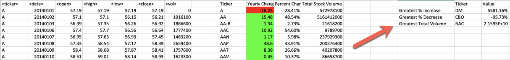

# VBA Challenge - The VBA of Wall Street

## Background

In this challenge you will use VBA scripting to analyze real stock market data. If looking for an extra challenge, there is a bonus section.

### Files

* [Test Data](Resources/alphabetical_testing.xlsx) - Use this while developing scripts.

* [Stock Data](Resources/Multiple_year_stock_data.xlsx) - Run your scripts on this data to generate the final report.

### Stock market analyst

## Instructions

* Create a script that will loop through all the stocks for one year and output the following information.

  * The ticker symbol.

  * Yearly change from opening price at the beginning of a given year to the closing price at the end of that year.

  * The percent change from opening price at the beginning of a given year to the closing price at the end of that year.

  * The total stock volume of the stock.

* You should also have conditional formatting that will highlight positive change in green and negative change in red.

* The result should look as follows.

* Make the appropriate adjustments to your VBA script that will allow it to run on every worksheet, i.e., every year, just by running the VBA script once.

### BONUS

* Your solution will also be able to return the stock with the "Greatest % increase", "Greatest % decrease" and "Greatest total volume". The solution will look as follows:

### Other Considerations

* Use the sheet `alphabetical_testing.xlsx` while developing your code. This data set is smaller and will allow you to test faster. Fast code should run on this file in less than 30 seconds.

* Make sure that the script acts the same on each sheet. The joy of VBA is to take the tediousness out of repetitive task and run over and over again with a click of the button.

## Submission

* To submit please upload the following to Github:

  * A screen shot for each year of your results on the Multi Year Stock Data.

  * VBA Scripts as separate files.
- - -

### Copyright

Trilogy Education Services © 2019. All Rights Reserved.
